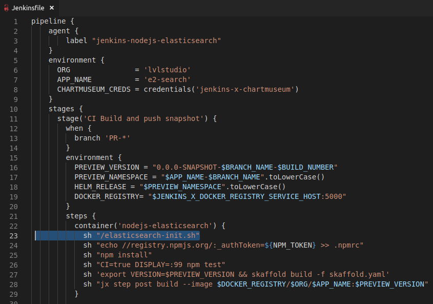

This is the section to include your `myvalues.yaml` file. Make sure to replace `BUILDER_VERSION` with the proper tag published on the [docker repository](https://cloud.docker.com/repository/docker/lvlstudio/builder-nodejs-elasticsearch).

```
jenkins:
  Agent:
    PodTemplates:
      NodejsElasticsearch:
        Name: nodejs-elasticsearch
        Label: jenkins-nodejs-elasticsearch
        volumes:
        - type: Secret
          secretName: jenkins-docker-cfg
          mountPath: /home/jenkins/.docker
        EnvVars:
          JENKINS_URL: http://jenkins:8080
          GIT_COMMITTER_EMAIL: jenkins-x@googlegroups.com
          GIT_AUTHOR_EMAIL: jenkins-x@googlegroups.com
          GIT_AUTHOR_NAME: jenkins-x-bot
          GIT_COMMITTER_NAME: jenkins-x-bot
          XDG_CONFIG_HOME: /home/jenkins
          DOCKER_CONFIG: /home/jenkins/.docker/
        ServiceAccount: jenkins
        Containers:
          Jnlp:
            Image: jenkinsci/jnlp-slave:3.26-1-alpine
            RequestCpu: "100m"
            RequestMemory: "128Mi"
            Args: '${computer.jnlpmac} ${computer.name}'
          Nodejs-Elasticsearch:
            Image: lvlstudio/builder-nodejs-elasticsearch:0.1.153
            Privileged: true
            RequestCpu: "400m"
            RequestMemory: "512Mi"
            LimitCpu: "2"
            LimitMemory: "2048Mi"
            # You may want to change this to true while testing a new image
            # AlwaysPullImage: true            
            Command: "/bin/sh -c"
            Args: "cat"
            Tty: true
```

Modify your app Jenkinsfile to use pipeline agent label `jenkins-nodejs-elasticsearch` and container `nodejs-elasticsearch` (instead of `jenkins-nodejs` and `nodejs`). 
Call `/elasticsearch-init.sh` before running your tests in both PR and master branches.


